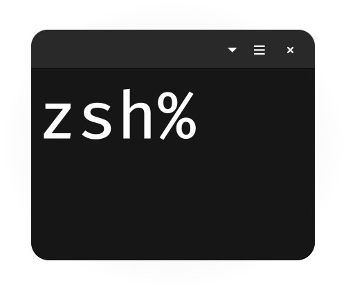
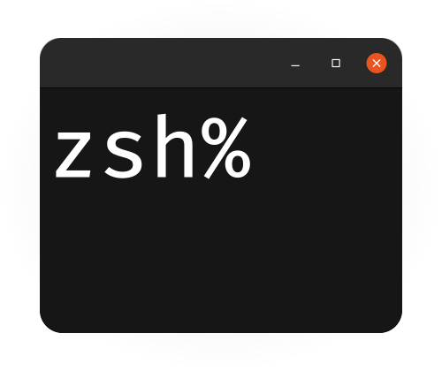
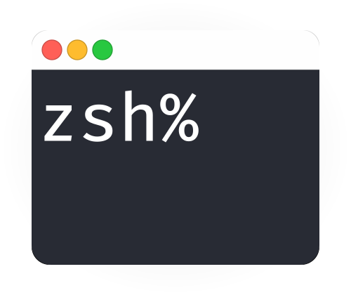
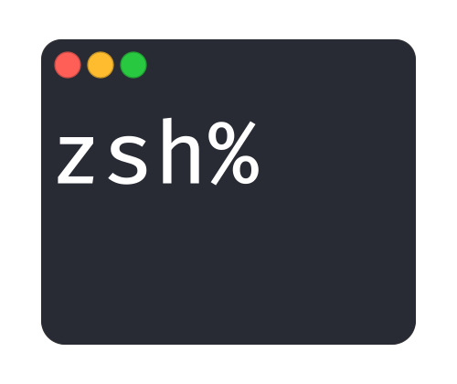
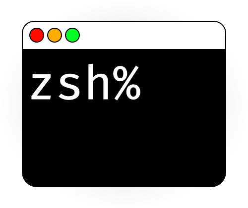
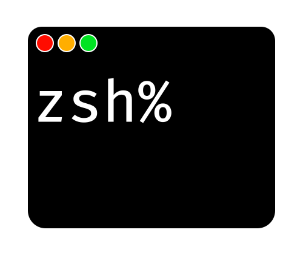

# ZSH Console Icons

Created for practicing with a vector program and trying out media queries in SVG graphics.

- [Images](#images)
- [Automatic day-night 🌃 switch](#automatic-day-night--switch)
- [Source File](#source-file)
- [Licence](#source-file)

## Images

Available icons with SVG preview.

<table>
<tr>
<th align="center">
    <small>
        Default
    </small>
</th>
<th align="center">
    <small>
        Classic
    </small>
</th>
</tr>
<tr>
<td>
    
</td>
<td>
    
</td>
</tr>
<tr>
<td>

[zsh-console-default.svg](zsh-console-default.svg)<br>
[zsh-console-default.png](zsh-console-default.png)<br>
[zsh-console-default@2x.png](zsh-console-default@2x.png)
</td>
<td>

[zsh-console-classic.svg](zsh-console-classic.svg)<br>
[zsh-console-classic.png](zsh-console-classic.png)<br>
[zsh-console-classic@2x.png](zsh-console-classic@2x.png)
</td>
</tr>
</table>


<table>
<tr>
<th align="center">
    <small>
        macOS Light
    </small>
</th>
<th align="center">
    <small>
        macOS Dark
    </small>
</th>
</tr>
<tr>
<td>
    
</td>
<td>
    
</td>
</tr>
<tr>
<td>

[zsh-console-macos-light.svg](zsh-console-macos-light.svg)<br>
[zsh-console-macos-light.png](zsh-console-macos-light.png)<br>
[zsh-console-macos-light@2x.png](zsh-console-macos-light@2x.png)
</td>
<td>

[zsh-console-macos-dark.svg](zsh-console-macos-dark.svg)<br>
[zsh-console-macos-dark.png](zsh-console-macos-dark.png)<br>
[zsh-console-macos-dark@2x.png](zsh-console-macos-dark@2x.png)
</td>
</tr>
</table>


<table>
<tr>
<th align="center">
    <small>
        macOS Light & Forced Colors
    </small>
</th>
<th align="center">
    <small>
        macOS Dark & Forced Colors
    </small>
</th>
</tr>
<tr>
<td>
    
</td>
<td>
    
</td>
</tr>
<tr>
<td>

[zsh-console-macos-forced-colors-light.svg](zsh-console-macos-forced-colors-light.svg)<br>
[zsh-console-macos-forced-colors-light.png](zsh-console-macos-forced-colors-light.png)<br>
[zsh-console-macos-forced-colors-light@2x.png](zsh-console-macos-forced-colors-light@2x.png)
</td>
<td>

[zsh-console-macos-forced-colors-dark.svg](zsh-console-macos-forced-colors-dark.svg)<br>
[zsh-console-macos-forced-colors-dark.png](zsh-console-macos-forced-colors-dark.png)<br>
[zsh-console-macos-forced-colors-dark@2x.png](zsh-console-macos-forced-colors-dark@2x.png)
</td>
</tr>
</table>


## Automatic day-night 🌃 switch

This icon will automatically change colors based on the selected operating system theme.

*Does not work in Safari on a Markdown page.

<table>
<tr>
<td>

</td>
</tr>
<tr>
<td>

[zsh-console-auto.svg](zsh-console-auto.svg)
</td>
</tr>
</table>

This SVG is manually edited and cannot be found in the artboard.

To test the color switch, open <b>Chrome Developer Tools</b> and the <b>Rendering</b> tab. There you can change the current ```prefers-color-scheme``` manually.

This icon supports the following media queries:

<table>
<tr>
<th align="center">
    CSS media query
</th>
<th align="center">
    Description
</th>
<th align="center">
    Static preview
</th>
</tr>
<tr>
<td>

`@media (prefers-color-scheme: light)`
</td>
<td>

Bright operating system theme (default)
</td>
<td>

[zsh-console-macos-light.svg](zsh-console-macos-light.svg)
</td>
</tr>
<tr>
<td>

`@media (prefers-color-scheme: dark)`
</td>
<td>

Dark operating system theme
</td>
<td>

[zsh-console-macos-dark.svg](zsh-console-macos-dark.svg)
</td>
</tr>
<tr>
<td>

`@media (forced-colors: active)`
</td>
<td>

  

High-contrast theme for people with low vision.
    
The colors used are determined by the browser, see at W3C CSS Color Module Level 4 - [6.2. System Colors](https://www.w3.org/TR/css-color-4/#css-system-colors).
</td>
<td>

[zsh-console-macos-forced-colors-light.svg](zsh-console-macos-forced-colors-light.svg)
</td>
</tr>
<tr>
<td>

`@media (forced-colors: active) and (prefers-color-scheme: dark)`
</td>
<td>

Dark high-contrast theme for people with low vision.
    
The colors used are determined by the browser, see at W3C CSS Color Module Level 4 - [6.2. System Colors](https://www.w3.org/TR/css-color-4/#css-system-colors).
</td>
<td>

[zsh-console-macos-forced-colors-dark.svg](zsh-console-macos-forced-colors-dark.svg)
</td>
</tr>
</table>

The file [zsh-console-auto.html](zsh-console-auto.html) contains an example for the embedding of this SVG graphic.

## Source File

The original file for editing can be found here [zsh-console-artboard.afdesign](zsh-console-artboard.afdesign). This can be opened with Affinity Designer or Affinity Photo. Use this file [zsh-console-artboard.svg](zsh-console-artboard.svg) to edit with another vector program.

The font is stored in the `package` folder under `zsh-console-artboard.afpackage`.

[Preview Artboards](https://user-images.githubusercontent.com/29308797/166165423-faac0fd3-5778-4997-986f-08c738329c2c.png)<br>
[Preview Slices](https://user-images.githubusercontent.com/29308797/166165420-12fbc64b-6bf1-43c1-b09d-836da15267ae.png)

Each icon is assigned to a drawing area, for <b>automatic export</b> of all icons as SVG and PNG click:<br>
`Export Persona -> Export Slices`

## Licence

This project is licensed under the MIT Licence license - See the [LICENSE](/LICENSE) file for more information.

---

&uarr; [Back to top](#zsh-console-icons)

