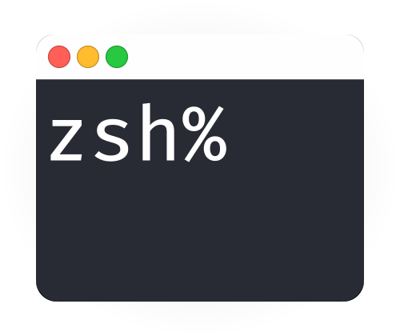

# ZSH Console Icons

A vector icon that displays a abstract console window. Created for practicing with a vector program and trying out media queries in SVG graphics.

- [ZSH Console Icons](#zsh-console-icons)
  - [Images](#images)
  - [Automatic day-night 🌃 switch](#automatic-day-night--switch)
  - [Colorful console](#colorful-console)
    - [Colors](#colors)
    - [Font](#font)
    - [Themes](#themes)
  - [Source File](#source-file)
  - [License](#license)

## Images

Available icons with SVG preview.

<table>
<tr>
<th align="center">
    <small>
        Default
    </small>
</th>
<th align="center">
    <small>
        Classic
    </small>
</th>
</tr>
<tr>
<td>
    
</td>
<td>
    
</td>
</tr>
<tr>
<td>

[zsh-console-default.svg](zsh-console-default.svg)<br>
[zsh-console-default.png](zsh-console-default.png)<br>
[zsh-console-default@2x.png](zsh-console-default@2x.png)
</td>
<td>

[zsh-console-classic.svg](zsh-console-classic.svg)<br>
[zsh-console-classic.png](zsh-console-classic.png)<br>
[zsh-console-classic@2x.png](zsh-console-classic@2x.png)
</td>
</tr>
</table>


<table>
<tr>
<th align="center">
    <small>
        macOS Light
    </small>
</th>
<th align="center">
    <small>
        macOS Dark
    </small>
</th>
</tr>
<tr>
<td>
    
</td>
<td>
    
</td>
</tr>
<tr>
<td>

[zsh-console-macos-light.svg](zsh-console-macos-light.svg)<br>
[zsh-console-macos-light.png](zsh-console-macos-light.png)<br>
[zsh-console-macos-light@2x.png](zsh-console-macos-light@2x.png)
</td>
<td>

[zsh-console-macos-dark.svg](zsh-console-macos-dark.svg)<br>
[zsh-console-macos-dark.png](zsh-console-macos-dark.png)<br>
[zsh-console-macos-dark@2x.png](zsh-console-macos-dark@2x.png)
</td>
</tr>
</table>


<table>
<tr>
<th align="center">
    <small>
        macOS Light & Forced Colors
    </small>
</th>
<th align="center">
    <small>
        macOS Dark & Forced Colors
    </small>
</th>
</tr>
<tr>
<td>
    
</td>
<td>
    
</td>
</tr>
<tr>
<td>

[zsh-console-macos-forced-colors-light.svg](zsh-console-macos-forced-colors-light.svg)<br>
[zsh-console-macos-forced-colors-light.png](zsh-console-macos-forced-colors-light.png)<br>
[zsh-console-macos-forced-colors-light@2x.png](zsh-console-macos-forced-colors-light@2x.png)
</td>
<td>

[zsh-console-macos-forced-colors-dark.svg](zsh-console-macos-forced-colors-dark.svg)<br>
[zsh-console-macos-forced-colors-dark.png](zsh-console-macos-forced-colors-dark.png)<br>
[zsh-console-macos-forced-colors-dark@2x.png](zsh-console-macos-forced-colors-dark@2x.png)
</td>
</tr>
</table>


## Automatic day-night 🌃 switch

This icon will automatically change colors based on the selected operating system theme.

*Does not work in Safari.


[Show different sizes of this icon](https://patbec.github.io/zsh-console-icons/) or test the color change with the developer tools.

This SVG is manually edited and cannot be found in the artboard.

This icon supports the following media queries:

<table>
<tr>
<th align="center">
    CSS media query
</th>
<th align="center">
    Description
</th>
<th align="center">
    Static preview
</th>
</tr>
<tr>
<td>

`@media (prefers-color-scheme: light)`
</td>
<td>

Bright operating system theme (default)
</td>
<td>

[zsh-console-macos-light.svg](zsh-console-macos-light.svg)
</td>
</tr>
<tr>
<td>

`@media (prefers-color-scheme: dark)`
</td>
<td>

Dark operating system theme
</td>
<td>

[zsh-console-macos-dark.svg](zsh-console-macos-dark.svg)
</td>
</tr>
<tr>
<td>

`@media (forced-colors: active)`
</td>
<td>


High-contrast theme for people with low vision.

The colors used are determined by the browser, see at W3C CSS Color Module Level 4 - [6.2. System Colors](https://www.w3.org/TR/css-color-4/#css-system-colors).
</td>
<td>

[zsh-console-macos-forced-colors-light.svg](zsh-console-macos-forced-colors-light.svg)
</td>
</tr>
<tr>
<td>

`@media (forced-colors: active) and (prefers-color-scheme: dark)`
</td>
<td>

Dark high-contrast theme for people with low vision.

The colors used are determined by the browser, see at W3C CSS Color Module Level 4 - [6.2. System Colors](https://www.w3.org/TR/css-color-4/#css-system-colors).
</td>
<td>

[zsh-console-macos-forced-colors-dark.svg](zsh-console-macos-forced-colors-dark.svg)
</td>
</tr>
</table>

The file [index.html](index.html) contains an example for the embedding of this SVG graphic.

## Colorful console

My console, recreated as a vector graphic. The font of the SVG is exported as a curve, use the [source file](#source-file) to edit the text.


### Colors

Used text ansi-colors in the terminal.

```
colors: {
    black:          '#000000',
    red:            '#C51E14',
    green:          '#1DC121',
    yellow:         '#C7C329',
    blue:           '#774CFF',
    magenta:        '#C839C5',
    cyan:           '#20C5C6',
    white:          '#C7C7C7',
    lightBlack:     '#686868',
    lightRed:       '#FF5430',
    lightGreen:     '#3FF12F',
    lightYellow:    '#F1F01F',
    lightBlue:      '#DA97FF',
    lightMagenta:   '#FF54FF',
    lightCyan:      '#01E5E6',
    lightWhite:     '#FFFFFF',
    limeGreen:      '#32CD32',
    lightCoral:     '#F08080',
}
```

Used foreground and background colors in the terminal.

```
foregroundColor: '#fff',
backgroundColor: '#282B34',
```

Used special colors in the terminal.

```
selectionColor: 'rgba(248,28,229,0.3)',
cursorColor: '#929292',
cursorAccentColor: '#000'
```

### Font

The font used is `Fira Code` with text size `18px`.

Fira Code is an open monospaced font with programming ligatures by Nikita Prokopov.
[(Download the font)](https://github.com/tonsky/FiraCode#download--install)

### Themes

Here you can find preconfigured terminal profiles, which contain the color and font settings.

Theme for the [hyper.is](https://hyper.is) terminal app:<br>
[.hyper.js](/packages/themes/.hyper.js)

Theme for the default macos terminal:<br>
[Colorful.terminal](/packages/themes/Colorful.terminal)

> There is no profile export function in the Gnome terminal.

The components used in this image are [exa](https://the.exa.website) as `ls` alternative and the [zsh shell](https://zsh.sourceforge.io) with the extensions [syntax-highlighting](https://github.com/zsh-users/zsh-syntax-highlighting), [autosuggestions](https://github.com/zsh-users/zsh-autosuggestions) and a custom `PROMT=` string. [Example installation with Ansible](https://github.com/patbec/ansible-role-zsh#sample-5).

## Source File

The original file for editing can be found here [zsh-console-artboard.afdesign](zsh-console-artboard.afdesign). This can be opened with Affinity Designer or Affinity Photo. Use this file [zsh-console-artboard.svg](zsh-console-artboard.svg) to edit with another vector program.

The font is stored in the `packages` folder under `zsh-console-artboard.afpackage`.

[Artboards preview](https://user-images.githubusercontent.com/29308797/166165423-faac0fd3-5778-4997-986f-08c738329c2c.png)<br>
[Slices preview](https://user-images.githubusercontent.com/29308797/166165420-12fbc64b-6bf1-43c1-b09d-836da15267ae.png)

Each icon is assigned to a drawing area, for <b>automatic export</b> of all icons as SVG and PNG click:<br>
`Export Persona -> Export Slices`

## License

This project is licensed under MIT - See the [LICENSE](LICENSE) file for more information.

---

&uarr; [Back to top](#zsh-console-icons)